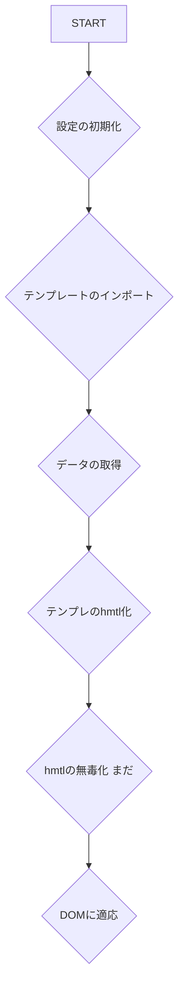

# overview

About Universal Ad Engine

The purpose of this project is to achieve easy debugging and secure ad rendering.

[About Templates](docs/template.md)

## TODO

- Add a docks
- Compatible with cdn
- Compatible with modules
- Publish to npm
- Add a test
- Support for sanitize
- Support for Google Ad Manager
- Publish the demo

